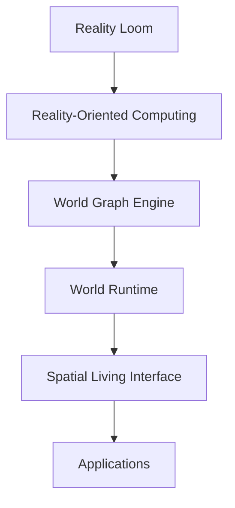
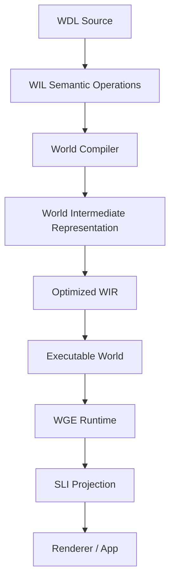
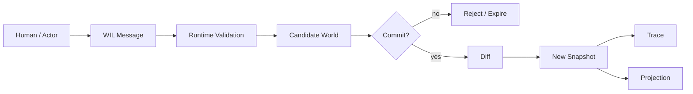
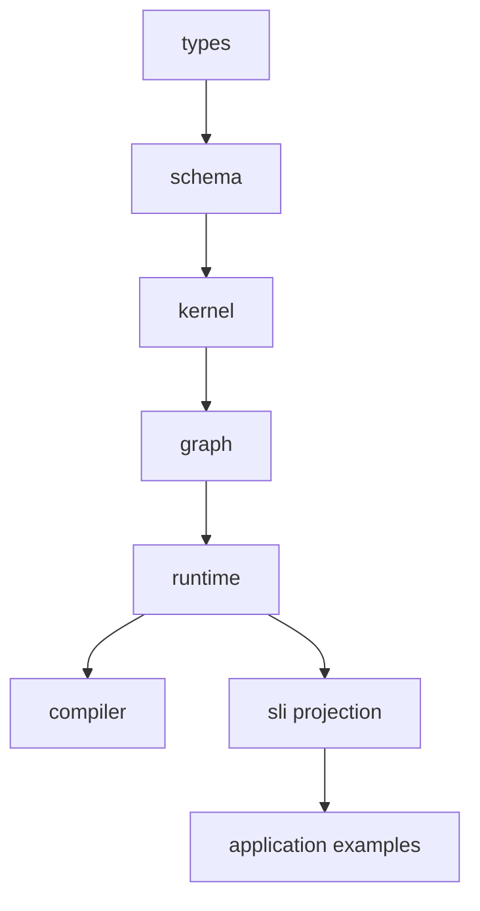
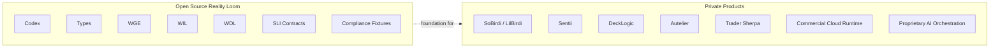

# Reality Loom Architecture

## High-Level Stack



## Compiler / Runtime Pipeline



## Truth Boundary



## Core Concepts

```text
World
Entity
Aspect
Relationship
Law
Event
Traversal
Snapshot
Diff
Trace
Candidate World
Executable World
Projection
```

## Invariants

```text
Applications describe worlds.
The runtime owns truth.
Candidate Worlds are possible, not real.
Commits require authority.
Snapshots are immutable.
Diffs are ordered.
Traces explain causality.
Projection is not authority.
AI is an actor, not a sovereign.
```

## Package Boundary Direction



## Public vs Private


